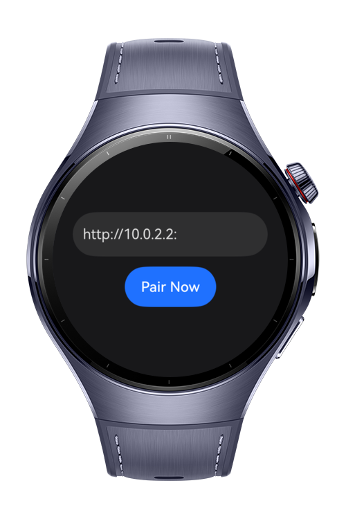
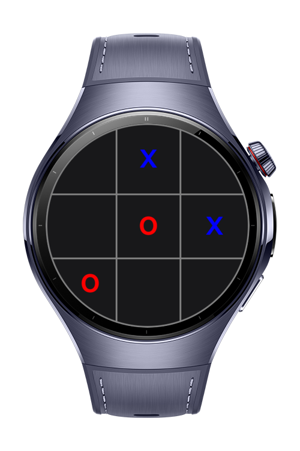

> **Note:** To access all shared projects, get information about environment setup, and view other guides, please visit [Explore-In-HMOS-Wearable Index](https://github.com/Explore-In-HMOS-Wearable/hmos-index).

# Tic-Tac-Toe LAN

`Tic-Tac-Toe LAN` is a multiplayer game designed for Huawei wearable devices that allows two players to compete against
each other over a local area network. When launched, each device automatically starts a local server, enabling direct
peer-to-peer connections between wearables on the same network. Players can discover and connect to each other using IP
addresses and engage in classic Tic-Tac-Toe gameplay in real-time.

The key innovation of this project is its LAN-based multiplayer functionality, demonstrating network communication
capabilities on wearable devices without requiring external servers or internet connectivity.

# Preview

<p align="left">
  
  
</p>

# Use Cases

Perfect for testing multiplayer wearable applications, demonstrating LAN-based peer-to-peer communication on HarmonyOS
devices, and providing entertainment for users with multiple wearable devices on the same network. The project showcases
advanced networking capabilities in constrained wearable environments.

# Technology

## Stack

- **Languages**: ArkTS
- **Frameworks**: HarmonyOS SDK 5.0.2(14)
- **Tools**: DevEco Studio Vers 5.1.0.820
- **Libraries**: @kit.ArkUI, @kit.NetworkKit

## Running on Two Devices

To test the multiplayer functionality on real devices, follow these steps:

### Prerequisites

- Two HarmonyOS devices connected to the same Wi-Fi network

### Setup Instructions

1. **Install and launch the app** on both devices.

2. **Find the local IP address** of one device (e.g., `192.168.1.45`).

3. **Connect the devices**:
    - On device A, open the pairing screen
    - Enter the connection address using the other device’s IP and app port, e.g.:
      ```
      http://192.168.1.45:4567
      ```
    - Device B will accept the connection automatically.

4. **Start playing** – both players can now play Tic-Tac-Toe in real-time.

### Network Architecture

Both devices must be on the same local network. One device acts as the host server, while the other connects as a
client using the host’s local IP address.

## Directory Structure

```
entry/src/main/ets/
├───entryability
│       EntryAbility.ets
├───entrybackupability
│       EntryBackupAbility.ets
├───lib
│       game_state.ts
│       http_server.ts
├───pages
│       Index.ets
└─── 
```

# Constraints and Restrictions

## Supported Devices

- Huawei Watch 5

# LICENSE

Snake is distributed under the terms of the MIT License.
See the [LICENSE](/LICENSE) for more information.